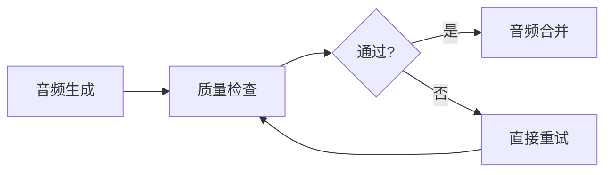
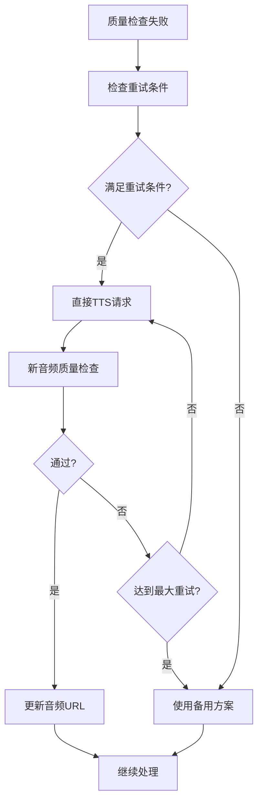

# 直接TTS重试功能使用指南

## 功能概述

app.py现在支持**直接HTTP请求TTS端点**，不再依赖Dify工作流触发。当TTS质量检查失败时，系统可以自动重新请求TTS服务，提高音频生成的成功率和质量。

## 核心特性

### 1. 直接HTTP请求
- 绕过Dify工作流，直接向TTS端点发送请求
- 支持自定义TTS服务端点配置
- 完整的错误处理和重试机制

### 2. 智能重试逻辑
- 基于质量检查结果的自动重试
- 可配置的最大重试次数
- 针对不同类型错误的差异化重试策略

### 3. 无缝集成
- 与现有音频处理流程完全兼容
- 自动更新音频URL映射
- 详细的日志记录和调试信息

## 配置参数

### TTS质量检查函数参数
```python
def _perform_tts_quality_check(
    audio_url: str,
    segment_id: str,
    expected_text: str,
    language: str = "zh",
    retry_count: int = 0,
    enable_direct_retry: bool = True,  # 新增：启用直接重试
    tts_endpoint: str = "http://ultrongw.woa.com/v2/tts/cyber-human/api/get_tts/sound.wav"  # 新增：TTS端点
)
```

### 直接TTS请求参数
```python
def _request_tts_directly(
    text: str,
    endpoint: str,
    language: str = "zh"
)
```

### 直接重试函数参数
```python
def _perform_direct_tts_retry(
    segment_id: str,
    expected_text: str,
    language: str = "zh",
    tts_endpoint: str = "http://ultrongw.woa.com/v2/tts/cyber-human/api/get_tts/sound.wav",
    max_retries: int = 3
)
```

## 使用示例

### 1. 基本使用（自动集成）
```python
# 在build_timed_audio_track函数中自动启用
quality_check = _perform_tts_quality_check(
    audio_url=audio_url,
    segment_id=sid,
    expected_text=seg.get("text", ""),
    language="zh",
    enable_direct_retry=True,  # 启用直接重试
    tts_endpoint="http://ultrongw.woa.com/v2/tts/cyber-human/api/get_tts/sound.wav"
)
```

### 2. 手动调用直接重试
```python
# 当质量检查失败时手动触发重试
if not quality_check["passed"] and quality_check.get("direct_retry_available"):
    retry_result = _perform_direct_tts_retry(
        segment_id="your_segment_id",
        expected_text="你的文本",
        language="zh",
        tts_endpoint="http://ultrongw.woa.com/v2/tts/cyber-human/api/get_tts/sound.wav"
    )
    
    if retry_result["retry_success"]:
        # 使用新生成的音频
        new_audio_url = retry_result["new_audio_url"]
```

### 3. 直接TTS请求（不依赖质量检查）
```python
# 直接请求TTS服务，不进行质量检查
tts_result = _request_tts_directly(
    text="要转换的文本",
    endpoint="http://ultrongw.woa.com/v2/tts/cyber-human/api/get_tts/sound.wav",
    language="zh"
)

if tts_result["success"]:
    audio_url = tts_result["audio_url"]
    # 使用生成的音频URL
```

## 工作流程

### 正常流程（质量检查通过）


### 重试流程（质量检查失败）


## 错误处理

### 常见错误类型
1. **TTS服务不可用**: HTTP请求失败或超时
2. **音频质量不合格**: 发音准确性不足或时长异常
3. **网络问题**: 下载或上传失败

### 错误恢复策略
- **自动重试**: 对临时性错误进行重试
- **渐进式延迟**: 重试间隔逐渐增加
- **错误分类**: 根据错误类型采取不同策略

## 配置建议

### 生产环境配置
```python
# 推荐的生产环境配置
ENABLE_DIRECT_TTS_RETRY = True
TTS_ENDPOINT = "http://ultrongw.woa.com/v2/tts/cyber-human/api/get_tts/sound.wav"
MAX_RETRIES = 3
RETRY_DELAY = 1.0  # 重试延迟（秒）
```

### 调试配置
```python
# 调试模式配置
DEBUG = True
ENABLE_DIRECT_TTS_RETRY = True
TTS_ENDPOINT = "http://ultrongw.woa.com/v2/tts/cyber-human/api/get_tts/sound.wav"
MAX_RETRIES = 1  # 调试时减少重试次数
```

## 监控和日志

### 关键日志信息
```python
# 启用DEBUG模式查看详细日志
if DEBUG:
    print(f"[TTS质量检查] {segment_id}: 质量检查结果")
    print(f"[TTS直接重试] 重试次数: {retry_count}")
    print(f"[TTS直接重试] 重试结果: {retry_success}")
```

### 性能指标
- 平均重试次数
- 重试成功率
- 音频质量改善程度
- 处理时间优化

## 最佳实践

### 1. 端点配置
- 使用可靠的TTS服务端点
- 配置适当的超时时间
- 考虑负载均衡和故障转移

### 2. 重试策略
- 根据业务需求调整重试次数
- 设置合理的重试延迟
- 监控重试成功率

### 3. 错误处理
- 实现完善的错误日志记录
- 设置适当的警报机制
- 准备备用方案

## 故障排除

### 常见问题
1. **TTS端点不可用**: 检查网络连接和端点状态
2. **认证失败**: 验证API密钥或访问权限
3. **音频格式不兼容**: 确认TTS服务支持的格式

### 调试技巧
- 启用DEBUG模式查看详细日志
- 使用测试脚本验证功能
- 检查网络连接和防火墙设置

## 版本兼容性

- **Python**: 3.7+
- **依赖库**: requests, uuid, os, sys
- **兼容性**: 与现有Dify工作流完全兼容

---

**注意**: 在使用直接TTS重试功能前，请确保TTS服务端点可用且具有适当的访问权限。