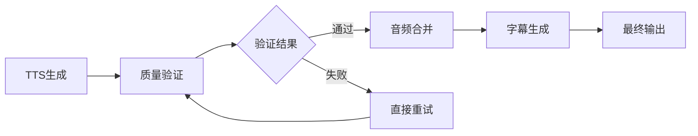

# 分离式TTS工作流配置指南

## 架构概述

推荐使用**分离式架构**，将TTS质量验证和音频合并分为两个独立的步骤：



## Dify工作流配置

### 步骤1：TTS质量验证节点

**HTTP节点配置**：
- **URL**: `http://your-server/app.py/validate_tts_audio`
- **Method**: POST
- **Headers**: `Content-Type: application/json`

**请求体示例**：
```json
{
    "placements": [
        {
            "segment_id": "seg_001",
            "start_time": 0.0,
            "end_time": 2.0,
            "text": "没毛病"
        }
    ],
    "audio_map": {
        "seg_001": "http://tts-service/audio1.wav"
    },
    "language": "zh",
    "tts_endpoint": "http://ultrongw.woa.com/v2/tts/cyber-human/api/get_tts/sound.wav",
    "max_retries": 3
}
```

**响应体示例**：
```json
{
    "all_passed": true,
    "validated_placements": [
        {
            "segment_id": "seg_001",
            "start_time": 0.0,
            "end_time": 2.0,
            "text": "没毛病"
        }
    ],
    "updated_audio_map": {
        "seg_001": "http://tts-service/audio1_verified.wav"
    },
    "quality_results": [...],
    "recommendation": "所有音频质量检查通过，可以继续合并处理"
}
```

### 步骤2：音频合并节点

**HTTP节点配置**：
- **URL**: `http://your-server/app.py/merge_audio`
- **Method**: POST
- **Headers**: `Content-Type: application/json`

**请求体示例**：
```json
{
    "placements": "{{步骤1.output.validated_placements}}",
    "audio_map": "{{步骤1.output.updated_audio_map}}",
    "total_duration": 10.0,
    "merge_id": "video_001"
}
```

## 优势分析

### 分离式架构的优势

1. **职责清晰**
   - 验证节点：专注于音频质量检查
   - 合并节点：专注于音频处理和字幕生成

2. **错误处理更精细**
   - 可以单独处理验证失败的情况
   - 支持批量重试和渐进式优化

3. **调试友好**
   - 可以单独测试验证功能
   - 可以单独测试合并功能
   - 日志信息更加清晰

4. **可扩展性强**
   - 易于添加新的验证规则
   - 易于调整合并策略
   - 支持A/B测试不同配置

### 性能考虑

虽然分离式架构增加了一次网络往返，但带来的好处远大于性能损失：

- **网络开销可控**：验证和合并都在同一服务器上，延迟很小
- **重试效率高**：验证失败时可以直接重试，无需重新触发整个工作流
- **资源利用率高**：可以并行处理多个验证任务

## 完整工作流示例

### Dify工作流配置

```yaml
workflow:
  name: "TTS音频处理工作流"
  nodes:
    - id: "tts_generation"
      type: "tts"
      config:
        # TTS生成配置
        
    - id: "quality_validation"
      type: "http"
      config:
        url: "http://your-server/app.py/validate_tts_audio"
        method: "POST"
        headers:
          Content-Type: "application/json"
        data:
          placements: "{{tts_generation.output.placements}}"
          audio_map: "{{tts_generation.output.audio_map}}"
          language: "zh"
          
    - id: "conditional_merge"
      type: "condition"
      config:
        condition: "{{quality_validation.output.all_passed}}"
        
    - id: "audio_merge"
      type: "http"
      config:
        url: "http://your-server/app.py/merge_audio"
        method: "POST"
        headers:
          Content-Type: "application/json"
        data:
          placements: "{{quality_validation.output.validated_placements}}"
          audio_map: "{{quality_validation.output.updated_audio_map}}"
          total_duration: "{{video_info.output.duration}}"
          
    - id: "subtitle_generation"
      type: "subtitle"
      config:
        # 字幕生成配置
```

## 错误处理策略

### 验证失败处理

1. **部分失败**：继续处理通过验证的音频
2. **全部失败**：提供详细错误信息和重试建议
3. **重试机制**：自动重试失败的任务

### 合并失败处理

1. **回滚机制**：保留原始音频文件
2. **错误报告**：提供详细的错误日志
3. **重试策略**：支持手动或自动重试

## 监控和日志

### 关键指标
- 验证成功率
- 平均验证时间
- 重试次数统计
- 合并成功率

### 日志级别
```python
# 验证节点日志
[TTS验证] 片段ID: seg_001 - 质量检查: 通过/失败
[TTS验证] 重试统计: 成功X次，失败Y次

# 合并节点日志  
[音频合并] 已验证音频合并完成: N个片段
[音频合并] 合并结果: 成功/失败
```

## 最佳实践

### 1. 配置优化
- 根据业务需求调整重试次数
- 设置合理的超时时间
- 配置适当的并发限制

### 2. 错误处理
- 实现完善的错误日志记录
- 设置适当的警报机制
- 准备备用方案

### 3. 性能优化
- 使用连接池减少网络开销
- 实现缓存机制提高响应速度
- 监控资源使用情况

## 迁移指南

### 从一体化迁移到分离式

1. **步骤1**：在Dify工作流中添加验证节点
2. **步骤2**：修改合并节点使用验证后的数据
3. **步骤3**：添加条件判断逻辑
4. **步骤4**：测试和优化

### 回滚策略

如果分离式架构出现问题，可以快速回滚到一体化方案：
- 临时禁用验证节点
- 直接调用原有的合并函数
- 保持业务连续性

---

**总结**：分离式架构虽然增加了一次网络往返，但带来了更好的可维护性、可调试性和可扩展性，特别适合复杂的音频处理场景。