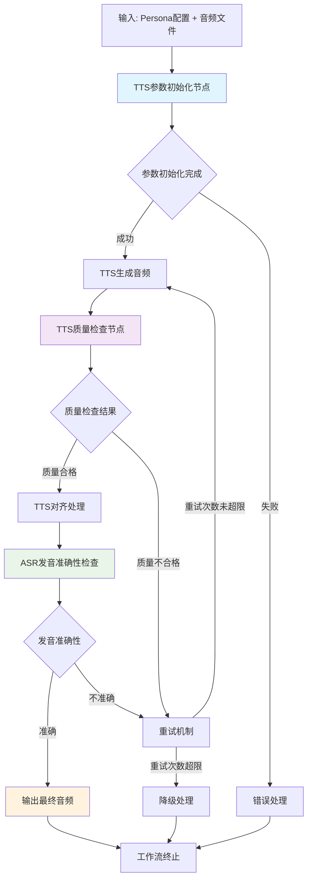

# TTS工作流处理流程

## 完整工作流示意图



## 节点功能说明

### 1. TTS参数初始化节点 (`tts_params_init_node.py`)

**输入参数:**
- `persona_profile_json`: Persona配置信息（JSON字符串）
- `files`: 音频文件列表（可选）

**输出参数:**
```python
{
    # TTS参数配置
    "retry_count": 0,           # 当前重试次数
    "max_retries": 3,           # 最大重试次数
    "language": "zh",          # 语言设置
    "quality_threshold": 0.8,   # 质量阈值
    "tts_voice_id": "",        # TTS语音ID
    "persona_id": "C",         # Persona ID
    "target_rate": 3.8,         # 目标语速
    "rate_type": "cps",        # 语速类型
    "workflow_status": "active", # 工作流状态
    
    # 音频时长信息
    "tts_duration": 2.5,        # 音频时长(秒)
    
    # 文件信息
    "has_audio_file": True,     # 是否有音频文件
    "file_count": 1             # 文件数量
}
```

### 2. TTS质量检查节点 (`tts_quality_check_node.py`)

**输入参数:**
- `tts_files`: TTS生成的音频文件列表
- `expected_texts`: 期望的文本内容
- `retry_count`: 当前重试次数
- `language`: 语言设置

**输出参数:**
```python
{
    "validation_results": [
        {
            "audio_index": 0,
            "expected_text": "测试文本",
            "passed": True,
            "quality_score": 0.85,
            "asr_result": "识别文本",
            "pronunciation_similarity": 0.92
        }
    ],
    "all_acceptable": "yes",
    "workflow_status": "completed",
    "overall_quality_score": 0.85,
    "needs_retry": "no",
    "asr_config_status": {...}
}
```

### 3. TTS对齐处理节点（待实现）

**功能:**
- 音频与文本的时间对齐
- 语速调整和优化
- 音质增强处理

### 4. ASR发音准确性检查（集成在质量检查节点中）

**功能:**
- 使用ASR服务识别音频内容
- 计算识别文本与预期文本的相似度
- 支持多种ASR服务提供商

## 工作流执行顺序

### 第一次执行（初始生成）
```
1. TTS参数初始化 → 2. TTS生成音频 → 3. 质量检查 → 4. 对齐处理 → 5. ASR检查 → 6. 输出结果
```

### 重试执行（质量不合格）
```
1. 质量检查 → 2. 判断需要重试 → 3. TTS生成音频（调整参数）→ 4. 质量检查 → ...
```

### 降级处理（重试次数超限）
```
1. 质量检查 → 2. 判断重试超限 → 3. 降级处理 → 4. 输出降级结果
```

## 输入输出变量映射

### 输入变量
| 变量名 | 类型 | 描述 | 来源 |
|--------|------|------|------|
| `persona_profile_json` | String | Persona配置JSON | 用户输入 |
| `files` | Array[Object] | 音频文件列表 | 前序节点或用户输入 |
| `expected_texts` | String/Array | 期望文本内容 | 文本处理节点 |
| `retry_count` | Number | 当前重试次数 | 工作流状态 |
| `language` | String | 语言设置 | Persona配置 |

### 输出变量
| 变量名 | 类型 | 描述 | 用途 |
|--------|------|------|------|
| `tts_duration` | Number | 音频时长(秒) | 时长统计 |
| `retry_count` | Number | 当前重试次数 | 重试控制 |
| `max_retries` | Number | 最大重试次数 | 重试限制 |
| `quality_threshold` | Number | 质量阈值 | 质量判断 |
| `overall_quality_score` | Number | 总体质量分数 | 质量评估 |
| `needs_retry` | String | 是否需要重试 | 流程控制 |
| `workflow_status` | String | 工作流状态 | 状态跟踪 |
| `pronunciation_similarity` | Number | 发音相似度 | ASR准确性 |

## 错误处理机制

### 1. 参数初始化错误
- Persona配置解析失败
- 音频文件访问失败
- **处理**: 返回默认参数，记录错误日志

### 2. 质量检查错误
- ASR服务不可用
- 音频文件损坏
- **处理**: 降级为基础检查，标记配置状态

### 3. 重试机制
- 质量分数低于阈值时自动重试
- 最大重试次数限制
- 重试参数调整策略

### 4. 降级处理
- 重试次数超限后的处理
- 使用简化质量检查
- 输出降级结果并记录

## 性能优化建议

### 1. 缓存策略
- ASR识别结果缓存
- 音频文件元数据缓存
- 配置信息缓存

### 2. 异步处理
- 批量音频处理
- 并行质量检查
- 异步ASR调用

### 3. 资源管理
- 连接池管理
- 内存使用优化
- 网络请求优化

## 扩展性设计

### 1. 插件化ASR服务
- 支持新的ASR服务提供商
- 服务发现和自动选择
- 配置热更新

### 2. 可配置参数
- 质量阈值可调整
- 重试策略可配置
- ASR服务优先级设置

### 3. 监控和日志
- 性能指标监控
- 错误日志记录
- 使用统计报告